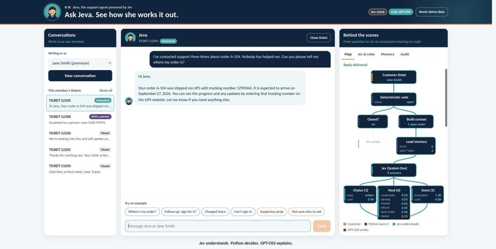
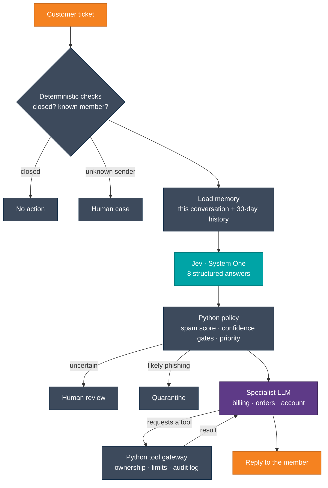

# Jeva: the support agent that shows its work

**Jev understands. Python decides. The LLM explains.**

Jeva is a customer support agent for a member services team, built on [Jev](https://typesafe.ai), TypeSafe's System One model. Every ticket goes through a pipeline you can watch in the UI. Jev turns the message into structured answers, plain Python applies the business rules, and an LLM writes the reply. The LLM can only *ask* for actions such as refunds or password resets. A Python gateway decides whether each one runs.



<p align="center">
  
  
  
  
  
</p>

## Why it's built this way

Most AI support bots let one model classify the ticket, decide the policy, call tools, and write the reply. Jeva splits those jobs by what each part is good at:

| Layer | Owns | Never does |
|-------|------|------------|
| **Jev** (System One) | Understanding: topic, phishing signals, refund intent, frustration, repeat contact | Decide anything or take an action |
| **Python** | Thresholds, routing, priority, tool permissions, and every database write | Guess at meaning |
| **LLM** (Groq gpt-oss or Claude) | Reasoning over tool results and writing a warm, plain-language reply | Run a business operation directly |

The result is auditable. Every decision has a number and a rule behind it. Every tool request, allowed or blocked, lands in an audit log. Suspicious messages are quarantined before any LLM sees them.

## How a ticket flows



### The eight questions Jev answers

| Question | Type | Used for |
|----------|------|----------|
| `topic`: which team should handle it? | Choice | Routing to the billing, orders, account or general specialist. `general` covers greetings and small talk. Below 0.75 confidence, the ticket goes to human review. |
| `requests_credentials` | Noul (0–1) | Spam score, weight 0.45 |
| `sender_identity_mismatch` | Noul | Spam score, weight 0.30 |
| `unexpected_reward` | Noul | Spam score, weight 0.25 |
| `refund_requested` | Noul | The gateway blocks `create_refund` unless this is ≥ 0.70 |
| `mentions_open_order` | Noul | Context for the orders specialist |
| `frustration` | Score (0–2) | High priority at ≥ 1.5 |
| `repeat_contact` | Noul | High priority when Jev says "same unresolved issue" **and** Python counts 2+ contacts in 7 days |

A spam score of 0.60 or more quarantines the ticket. Between 0.40 and 0.60 it goes to a person.

Every member gets a reply except quarantined phishing. When Python hands a ticket to a person, Jeva tells the member and gives the case number. That message is fixed text, so no LLM is involved.

## Quick start

You need Python 3.10+ and Node 18+. Node is only used once, to build the frontend.

```bash
git clone https://github.com/allaabdella2-us/jeva-support-agent.git
cd jeva-support-agent
./start.sh
```

Open **http://localhost:8000**.

On the first run, `start.sh` creates `backend/.env` from the template, sets up a virtualenv, installs everything, builds the frontend, checks your keys and starts the server. With no keys, Jev and the LLM run on local stand-ins, so every route still works offline.

To go live, add your keys to `backend/.env` and run `./start.sh` again:

```ini
TYPESAFE_API_KEY=sk-...      # Jev, from your TypeSafe account
GROQ_API_KEY=gsk_...         # free at https://console.groq.com/keys
```

Check the keys without starting the app:

```bash
cd backend && .venv/bin/python check_keys.py
```

```
Jev (TypeSafe)  OK    jev-..., refund noul 0.97
LLM (Groq)      OK    openai/gpt-oss-20b: Hi Jane, welcome!
```

## Configuration

Everything is in `backend/.env`, which git ignores. Variables exported in your shell override it.

| Setting | What it does | Default |
|---------|--------------|---------|
| `TYPESAFE_API_KEY` | Key for Jev | not set |
| `JEV_MODE` | `auto`: live if the key is accepted, otherwise the stand-in, with a notice in the UI. `live`: always call TypeSafe. `mock`: always use the stand-in. | `auto` |
| `JEV_MODEL` | Jev model name | `jev-latest` |
| `LLM_PROVIDER` | `auto`, `groq`, `anthropic` or `mock`. `auto` picks Claude, then Groq, then the mock. | `auto` |
| `GROQ_API_KEY` | Groq key for `openai/gpt-oss-20b` | not set |
| `GROQ_MODEL` | For example `openai/gpt-oss-120b`, which follows instructions more closely | `openai/gpt-oss-20b` |
| `GROQ_REASONING_EFFORT` | `low`, `medium` or `high` | `low` |
| `ANTHROPIC_API_KEY` | Use Claude (`claude-sonnet-5`) for replies | not set |
| `SUPPORT_DB_PATH` | Where the SQLite file lives | `backend/support.db` |

The header badges show what is running. Hover over them for the model name, or for the reason Jev isn't live.

## Things to try

The chips under the chat run these scenarios. The seed data includes a member, Jane, with open orders, a duplicate charge, and three recent contacts about a late order.

| Example | What happens |
|---------|--------------|
| Type **hi** | Jev picks `general`, and Jeva greets the member and asks how she can help. |
| **Where's my order?** | Memory finds 3 earlier contacts about A-104, so it's a repeat contact with high priority. `get_order_status` runs. |
| **Follow-up: sign for it?** | Same ticket. Earlier turns are replayed, so the LLM knows what "it" means. It says the order data doesn't cover signatures instead of guessing. |
| **Charged twice** | `create_refund` refunds the duplicate charge on A-101. Asking again returns the same refund, because refunds are idempotent per ticket. |
| **Can't sign in** | `reset_password` sends a link. Only a hash of the token is stored, and the LLM never sees the token. |
| **Suspicious prize** | A spoofed "Rewards Team" sender asks for a password and claims a reward. Quarantined, and no LLM is called. |
| **Not sure who to ask** | Low topic confidence, so the ticket goes to human review, and Jeva tells the member a person will follow up. |
| Pick "Someone else…" as sender | Unknown email, so a human case opens before any AI runs. |
| Close the ticket, then send | The deterministic check stops it: no action. |

**Reset demo data** in the header restores the seed data.

## Guardrails in the tool gateway

The LLM sees four tools: `get_order_status`, `create_refund`, `reset_password` and `create_human_case`. It never sees member or ticket IDs. The gateway takes those from the session, so a prompt can't make it act on another member's account. It also enforces these rules:

- **Ownership:** order lookups and refunds are filtered by the session's member.
- **Policy:** `create_refund` needs Jev's refund signal, and `reset_password` only runs on account tickets.
- **Limits:** refunds over $100 wait for approval. At most 5 tool rounds per reply, then the ticket goes to a person.
- **Audit:** every request is logged with its arguments, result and whether it was allowed. See the **Audit** tab.

## Project structure

```
jeva-support-agent/
├── start.sh                     One command: set up, check keys, serve on :8000
├── docs/screenshot.jpg
├── backend/
│   ├── api.py                   FastAPI routes; also serves the built frontend
│   ├── support_agent_claude.py  The pipeline: Jev → Python policy → LLM + tool gateway
│   ├── support_db.py            SQLite schema, seed data, memory helpers
│   ├── groq_llm.py              Groq adapter with the same interface as the Anthropic client
│   ├── mock_models.py           Offline stand-ins for Jev and the LLM
│   ├── check_keys.py            One live call to each provider
│   ├── env.py                   Loads backend/.env
│   ├── .env.example             Settings template (copied to .env)
│   └── requirements.txt
└── frontend/                    React 18 + Vite
    └── src/
        ├── App.jsx              State, sending, ticket selection
        ├── mapModel.js          Pipeline map layout and animation plan
        └── components/          Jeva (avatar), Sidebar, Chat, Inspector, PipelineMap
```

## Development

Run the backend with reload, and the Vite dev server with hot reload:

```bash
# terminal 1
cd backend && source .venv/bin/activate
uvicorn api:app --reload --port 8000

# terminal 2
cd frontend && npm install && npm run dev    # http://localhost:5173, proxies /api to :8000
```

After frontend changes, run `npm run build`. FastAPI serves `frontend/dist` at http://localhost:8000.

To exercise the pipeline from the command line, `python support_agent_claude.py` runs a two-turn conversation and `python groq_llm.py` runs a Groq tool-call round trip.

## API

| Method | Path | Purpose |
|--------|------|---------|
| GET  | `/api/health` | Modes, models, and why Jev isn't live (`jev_note`) |
| GET  | `/api/customers` | Members |
| GET  | `/api/customers/{id}/history` | Memory summary for a member |
| GET  | `/api/tickets?customer_id=` | Tickets, newest first |
| GET  | `/api/tickets/{id}` | One ticket and its messages |
| GET  | `/api/tickets/{id}/audit` | Tool audit log for a ticket |
| POST | `/api/tickets/{id}/close` | Close a ticket |
| POST | `/api/chat` | `{ticket_id?, message, sender_name, sender_email}` → result, trace and messages |
| POST | `/api/reset` | Rebuild the database from seed data |

`/api/chat` returns a `trace` of every step for the UI. It holds Jev's answers (with the model and token count), the policy numbers, the route, tool calls and the reply. The trace is never sent to the models.

## Troubleshooting

| Symptom | Fix |
|---------|-----|
| Orange notice: "Jev is using the local stand-in … rejected (401)" | TypeSafe doesn't accept `TYPESAFE_API_KEY`. Replace it in `backend/.env` and restart. |
| A reply takes 10–25 seconds | Groq free-tier rate limit (HTTP 429). The client waits and retries, so the reply still arrives. |
| "Couldn't reach Jeva: Pipeline error: …" | A provider call failed after retries. The message names the cause. |
| "This site can't be reached" | The server isn't running. Run `./start.sh` and keep that terminal open. |
| `Address already in use` | Port 8000 is taken. Use `PORT=8080 ./start.sh`. |
| `permission denied: ./start.sh` | Run `chmod +x start.sh` once, or use `bash start.sh`. |

## Before production

This is a demo on fake data. Before you use it on real members:

- add authentication (right now anyone can write in as any member)
- use a real database
- send reset links through a real email service
- put an approval workflow behind `pending_approval` refunds

The seed history is dated Sept 22–24, 2026. A week or so later, Jane's contacts fall outside the 7-day repeat-contact window.
